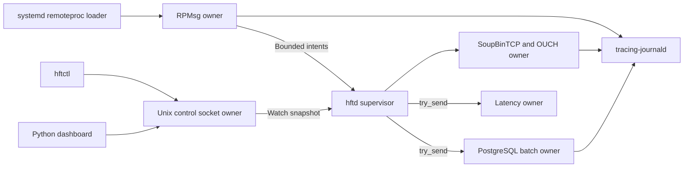
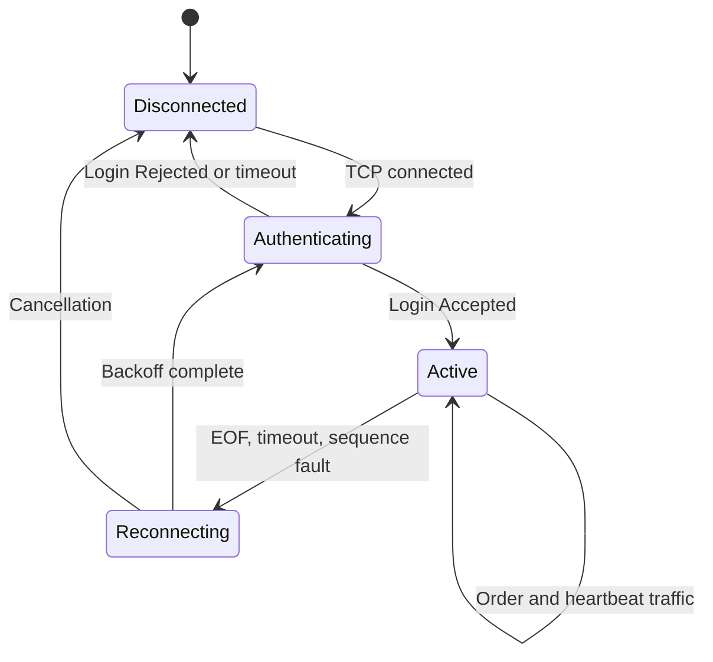

# Cortex-A53 Linux architecture

## Actor graph

Each socket/session and mutable state machine has exactly one owner. Bounded
channels transfer values. The order path has no `Arc<Mutex<_>>`; immutable
configuration can be shared through `Arc` and replaced by version. Tokio tasks
yield after bounded work. Database saturation drops only a persistence copy and
increments a metric.

## RPMsg lifecycle

The remoteproc unit loads `/lib/firmware/hft-r5.elf`, starts R5-0, and waits for
the RPMsg endpoint. `hftd` opens the character endpoint with one RAII owner.
Every 64-byte record is decoded field-by-field and checked for ABI version.
Kernel reset, EOF, short record, or ABI mismatch ends the actor and leaves
systemd restart policy in control.

## OUCH state machine

The first implementation covers login, heartbeats, Enter/Replace/Cancel
encoding, and accepted/rejected lifecycle framing against the simulator. Live
credentials are not supported by defaults and are never logged.

## Observability

Rust `tracing` fields include session ID, source sequence, user reference,
symbol, risk revision, component, and latency domain. On Yocto, records go to
`systemd-journald`; on a developer host they fall back to formatted stderr.
R5 CIB records are forwarded and re-emitted under the `hftd` unit.

## PostgreSQL

PostgreSQL stores sessions, instruments, order lifecycle, latency summaries,
and health events. It never stores the full market-data stream. SQLx executes
forward-only migrations. `/var/lib/postgresql` maps to the persistent data
partition, outside A/B root filesystems. Schema changes follow expand/contract
rules so one previous software slot can read the new schema during rollback.

## Local API

`hftctl` and the Textual dashboard use `/run/hftd/control.sock`. The control
actor owns armed/killed state and risk parameters, validates a full request,
increments the revision, then publishes one immutable snapshot. The default is
unarmed and killed.
