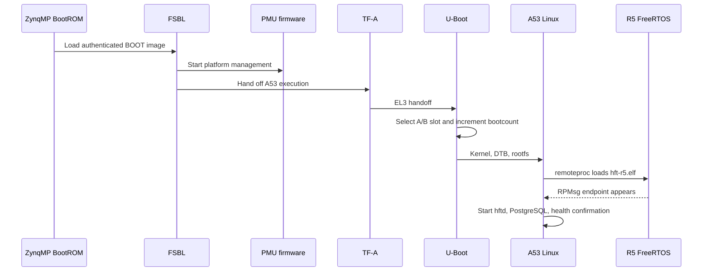
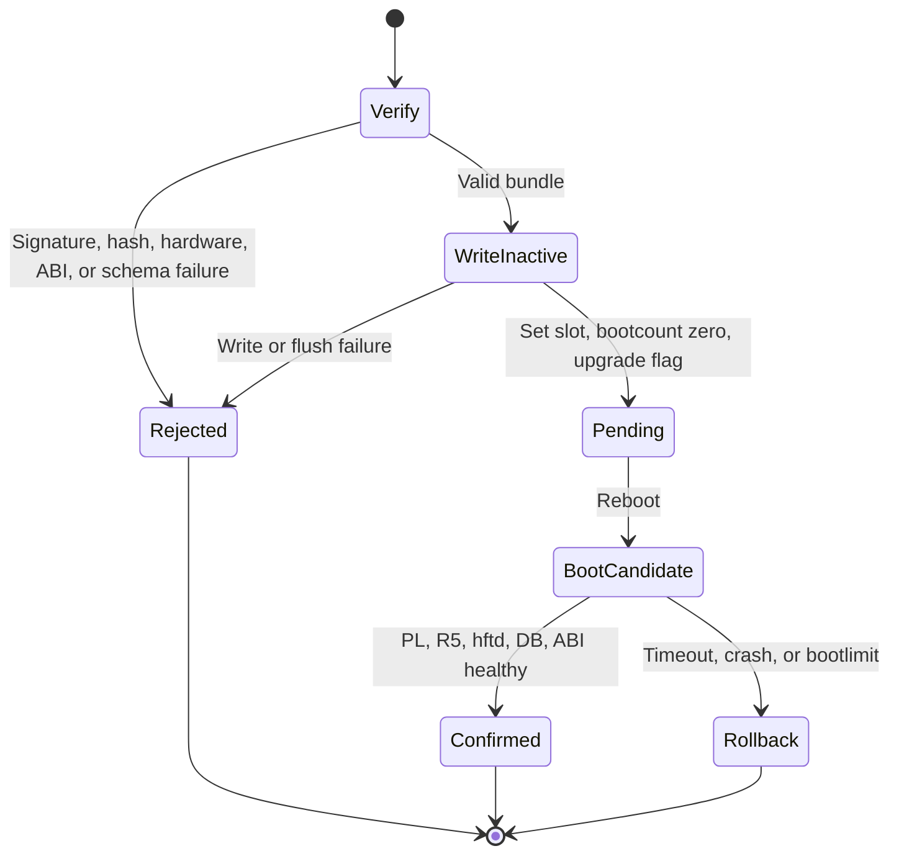

# Boot and update architecture

## Boot chain

## Partition layout

The WIC image has `boot_a`, `boot_b`, `rootfs_a`, `rootfs_b`, and `hft_data`.
The active root is read-only where practical. PostgreSQL, update state, and
operator configuration live on `hft_data` and are not replaced by an OS update.

## SWUpdate transaction

Bundles contain matching boot artifacts, rootfs, and R5 firmware. CMS/RSA
signatures and SHA-256 hashes are checked before writes. Private keys remain
outside the repository. Bootloader updates are excluded from routine bundles to
preserve recovery.

## Database compatibility

Migrations are expand/contract and a backup is taken before update. The new
schema must remain readable by the previous slot. A bundle declares a schema
range and is rejected before installation if the persistent database is outside
that range.

## Current verification boundary

CI builds and parses bundle contracts and writes synthetic inactive-slot images.
It does not reboot a ZCU102. U-Boot environment persistence, bootcount rollback,
power loss, actual block-device aliases, FPGA build-ID health, and remoteproc
startup remain pending hardware.
