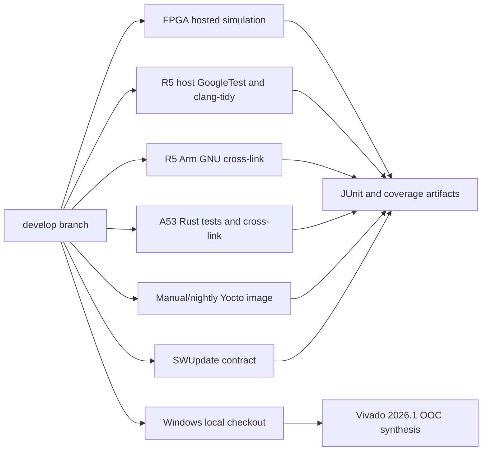

# Build and CI architecture

## Build topology

## Local Windows FPGA build

The source belongs at `C:\Users\121679\hft-toy-project`; Vivado belongs at
`C:\AMDDesignTools\2026.1\Vivado`. `verify-tools.ps1` checks both assumptions and
the version. `build-fpga.ps1` invokes one Tcl entry point, places generated state
under `build\vivado`, and never opens hardware manager.

## C++ build matrix

- Clang debug with ASan/UBSan.
- GCC coverage with gcovr HTML/Cobertura.
- Arm GNU 13.3.Rel1 C++23 cross-link with exceptions/RTTI disabled.
- CIB and `fmt` enabled in the target lane.
- A host C++26 reference lane is defined for a GCC 16 environment; target code
  remains C++23 because that is the selected supported policy.

Dependencies are immutable CMake FetchContent revisions or release archives.
The target toolchain archive is checksum-verified.

## Rust build matrix

Rust 1.97.1/Edition 2024 runs fmt, Clippy, unit/property tests, mockall actor
tests, SQL migration validation, cargo-audit/deny, llvm-cov, and an
`aarch64-unknown-linux-gnu` release build. Cargo.lock is committed.

## FPGA verification

GHDL provides a fast compatibility test. CI installs the pinned NVC 1.23.0
Ubuntu 24.04 package and collects statement, branch, and functional coverage
from the simulator databases. VSG checks synthesizable RTL and testbenches.
Vivado reports are local artifacts because the selected Windows installation
is not a GitHub runner.

## Workflow boundary

Pushes to `develop` trigger FPGA, R5, and A53 workflows. Yocto is manual/nightly
because of its resource footprint. No job includes JTAG, a board hostname,
hardware credentials, or remote SWUpdate installation.
