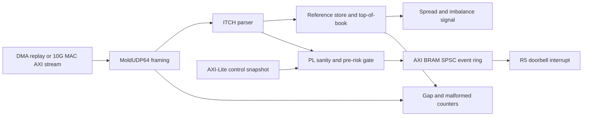
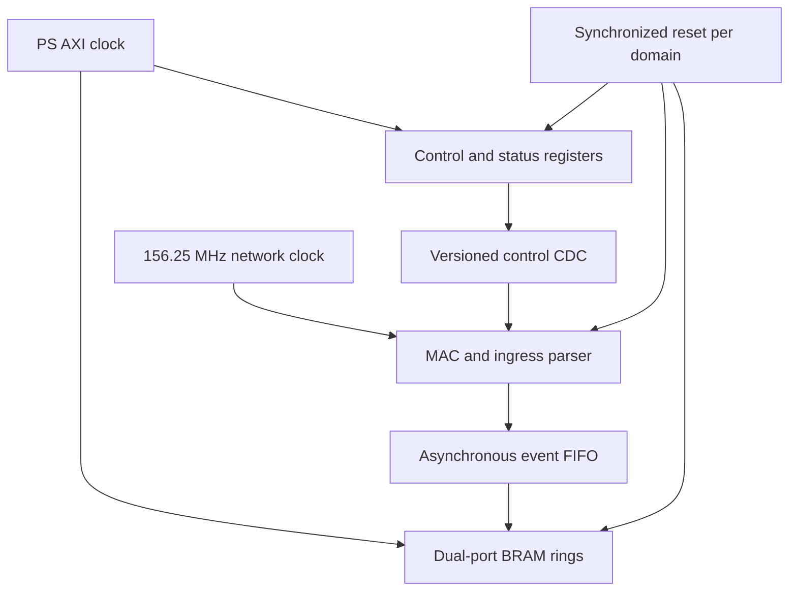

# FPGA architecture

## Pipeline



The synthesizable core accepts one byte per cycle in the open-source reference
simulation. The future MAC wrapper widens this boundary to the selected AMD AXI
stream width while preserving packet start/end markers. Backpressure propagates
only while a complete normalized event waits for the R5 ring; production sizing
must ensure normal traffic never reaches that state.

## Clock and reset domains



The current `sim-dma` core has one `axis_clk`; asynchronous FIFO wrappers are a
board-integration boundary because no XSA or physical board exists yet. Vivado
CDC findings at that boundary must be resolved before hardware deployment.

## State and capacity

- MoldUDP64 tracks the next expected 64-bit sequence and emits one sequence per
  length-prefixed message.
- ITCH decoding never overlays packed language records on network bytes.
- The reference order store is fixed-capacity BRAM-oriented state. Duplicate
  references update in place; overflow is counted and kills trading.
- Best bid/ask is derived from valid entries. The educational implementation
  does not claim the resource/latency behavior of a production full-depth book.
- Price and quantity arithmetic is integer-only.

## Control and status

The generated map starts at `0xA0000000`. Writes configure enable, kill, clear,
quantity, and price collar. Reads expose ABI/build ID, synchronized status,
sequence, packet, gap, malformed, and drop counters. A control revision becomes
visible atomically; partially written risk parameters are never used.

## Failure behavior

| Condition | Result |
| --- | --- |
| Early end-of-packet | Malformed counter and kill latch |
| Sequence mismatch | Gap counter, stale state, kill latch |
| Unknown framed ITCH type | Skip and unknown counter |
| Order-store capacity | Overflow counter and kill latch |
| R5 ring full | Drop counter and kill latch |
| External kill | Entries blocked; lifecycle traffic retained |

## Vivado profiles

`sim-dma` performs license-free out-of-context synthesis of the VHDL core.
`sfp10g` checks that the AMD 10G/25G subsystem exists but deliberately defers
MAC/PCS and pin integration until a board and appropriate license are available.
The exact local command is:

```powershell
Set-Location C:\Users\121679\hft-toy-project
.\scripts\windows\build-fpga.ps1 -Profile sim-dma
```

No script invokes hardware manager or programs a device.
