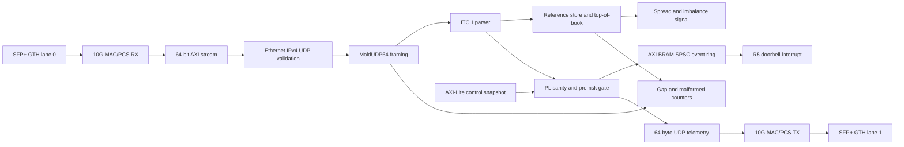
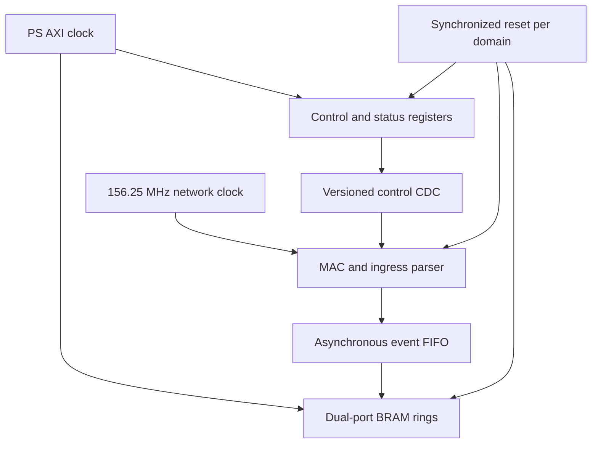

# FPGA architecture

## Pipeline



`axis64_to_byte` terminates the simulator-friendly 64-bit MAC boundary and
preserves `tkeep`, frame start, frame end, and backpressure. `udp_ipv4_rx`
accepts Ethernet II, fixed-header IPv4, and UDP only. It verifies destination
MAC/IP/port, IPv4 checksum, lengths, non-fragmentation, and the zero UDP
checksum policy before exposing the MoldUDP64 payload. Unsupported or malformed
traffic is counted and never enters the trading pipeline.

`telemetry_udp_tx` emits fixed 64-byte records containing normalized events,
status flags, and drop counters. It uses static destination MAC/IP/port values,
so ARP and route discovery remain outside the deterministic hot path. Live
order entry still uses the R5/A53 SoupBinTCP/OUCH path.

## Clock and reset domains



The current OOC core has one `axis_clk` at 156.25 MHz. The AMD MAC/PCS and GTH
reset/CDC implementation remain at the proprietary IP boundary. Vivado CDC
findings at that boundary must be resolved before hardware deployment.

## State and capacity

- MoldUDP64 tracks the next expected 64-bit sequence and emits one sequence per
  length-prefixed message.
- ITCH decoding never overlays packed language records on network bytes.
- The reference order store is fixed-capacity BRAM-oriented state. Duplicate
  references update in place; overflow is counted and kills trading.
- Best bid/ask is derived from valid entries. The educational implementation
  does not claim the resource/latency behavior of a production full-depth book.
- Price and quantity arithmetic is integer-only.

## Control and status

The generated map starts at `0xA0000000`. Writes configure enable, kill, clear,
quantity, and price collar. Reads expose ABI/build ID, synchronized status,
sequence, packet, gap, malformed, and drop counters. A control revision becomes
visible atomically; partially written risk parameters are never used.

## Failure behavior

| Condition | Result |
| --- | --- |
| Wrong MAC/IP/UDP destination | Drop counter; no trading-state change |
| IPv4 checksum, fragment, or length error | Malformed counter and kill latch |
| RX MAC error or link loss | Network fault and kill latch |
| Early end-of-packet | Malformed counter and kill latch |
| Sequence mismatch | Gap counter, stale state, kill latch |
| Unknown framed ITCH type | Skip and unknown counter |
| Order-store capacity | Overflow counter and kill latch |
| R5 ring full | Drop counter and kill latch |
| External kill | Entries blocked; lifecycle traffic retained |

## Vivado profiles

`sim-dma` performs license-free out-of-context synthesis of the VHDL core.
`sfp10g` checks that the AMD 10G/25G subsystem exists. The repo-local board
definition selects `xczu5ev-sfvc784-2-e`; its Bank 224 constraints reserve GTH
lanes 0 and 1 plus `MGTREFCLK0`. The public MYIR pinout does not identify the
physical cage order or provide a verified ZynqMP DDR/PS preset, so integrated
bitstream/XSA generation deliberately fails.
The exact local command is:

```powershell
Set-Location C:\Users\121679\hft-toy-project
.\scripts\windows\build-fpga.ps1 -Profile sim-dma
```

No script invokes hardware manager or programs a device.
