# IPC and memory map

## Reserved regions

| Region | Base | Size | Owner | Cache policy |
| --- | ---: | ---: | --- | --- |
| R5 ELF/load | `0x3ed00000` | 256 KiB | remoteproc/R5 | no-map |
| RPMsg vring 0 | `0x3ed40000` | 16 KiB | Linux/R5 | no-map |
| RPMsg vring 1 | `0x3ed44000` | 16 KiB | Linux/R5 | no-map |
| RPMsg buffers | `0x3ed48000` | 1 MiB | Linux/R5 | shared DMA |
| PL event ring | `0x3ef00000` | 1 MiB | PL producer/R5 consumer | noncoherent shared |
| PL registers | `0xa0000000` | 64 KiB | PL with PS access | device |

The MYD device-tree fragment exposes the register span as `generic-uio` and
binds the PL ring reserved memory. It is still a provisional executable
contract: addresses and the future PL interrupt must be compared with the
generated XSA/SDT before board use.

## Record layout

Both `MarketEvent` and `OrderIntent` are 64 bytes and aligned to a cache line.
The first two bytes are the ABI version. Fields use explicit fixed-width
integers; no C++, Rust, or VHDL packed record is copied directly from venue
bytes. Generated static assertions verify size in C++ and Rust.

```mermaid
flowchart LR
    Abi["Bytes 0-1: ABI"] --> Kind["Byte 2: kind or action"]
    Kind --> Side["Byte 3: side"]
    Side --> Ref["Bytes 4-7: flags or user ref"]
    Ref --> Seq["Bytes 8-15: source sequence"]
    Seq --> Time["Bytes 16-23: timestamp"]
    Time --> Identity["Bytes 24-31: reference or symbol"]
    Identity --> Value["Bytes 32-47: symbol, price, or quantity"]
    Value --> Tail["Bytes 48-63: quantity, revision, reserved"]
```

## Ring protocol

1. Producer reads consumer index with acquire semantics.
2. If `write - read == capacity`, it executes the ring-specific overflow policy.
3. Producer writes one full record.
4. Producer performs a device/cache barrier where required.
5. Producer publishes the new write index with release semantics.
6. Consumer observes write index with acquire semantics, reads the record, then
   publishes its read index.

There is exactly one producer and one consumer. Adding another is an
architecture change, not a locking exercise.

## ABI negotiation

Build ID, schema digest, ABI version, R5 firmware version, and Linux service
version are reported together. An ABI mismatch prevents arming. Additive fields
consume reserved bytes first; incompatible changes increment the ABI and require
coordinated PL/R5/A53 artifacts in one SWUpdate bundle.
