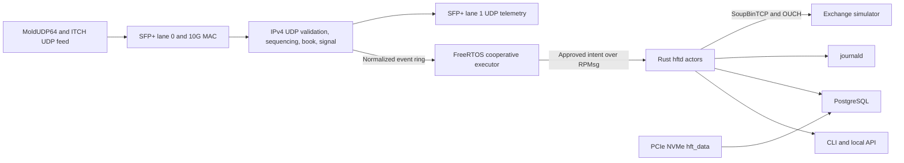

# Architecture overview

## Purpose and scope

The design demonstrates how a deterministic programmable-logic ingress path,
an R5 real-time decision layer, and an A53 Linux service layer can share one
versioned protocol contract. It implements a simulator-facing ITCH/OUCH slice,
not a live venue adapter. Linux/TCP work is intentionally outside the
tick-to-intent latency boundary.

## Responsibility boundaries

- **PL:** validate bytes, detect feed gaps, update a bounded book, timestamp,
  apply a cheap risk gate, and publish fixed-size events without allocation.
- **R5:** own authoritative risk/order state and produce an approved order
  intent with bounded cooperative handlers and no blocking lock.
- **A53:** own network sessions, remoteproc/RPMsg lifecycle, observability,
  persistence, update orchestration, and operator interfaces.
- **MYD storage:** boot and read-only A/B roots remain on eMMC; a manually
  provisioned GPT partition labelled `hft_data` supplies `/data` over PCIe
  Gen2 x1 NVMe.
- **PostgreSQL/UI/logging:** consume bounded copies and never backpressure the
  trading path.

## Latency boundaries

`tick-to-intent` starts at PL ingress and ends when R5 publishes an approved
intent. `intent-to-ack` starts when A53 receives the intent and includes Linux,
TCP, and simulator behavior. Reports never combine them into a misleading
single deterministic number.

## Fail-closed behavior

A gap, malformed length, capacity overflow, stale ABI/configuration, queue
overflow, or watchdog failure kills trading. Recovery requires resynchronizing
state and an explicit arm command. Unknown but well-framed ITCH messages are
counted and skipped.

## Verification status

Open-source simulation and host models verify contracts and state transitions.
Vivado synthesis is a local Windows operation. Actual SFP cage ordering,
MAC/PCS/GTH reset, cache, interrupt, remoteproc, PCIe, boot, SWUpdate rollback,
and latency behavior is deferred until a board is available.
