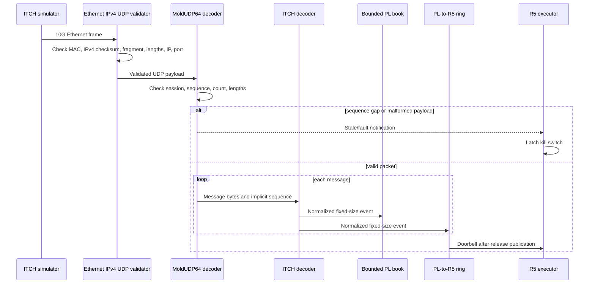
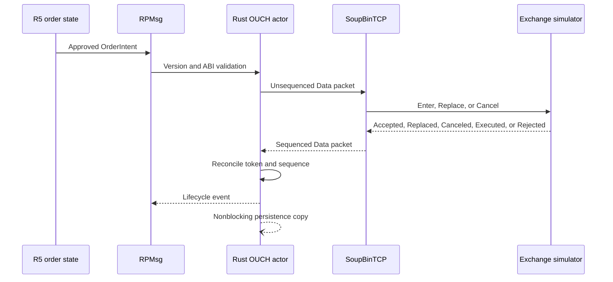

# Protocol and order flow

## Canonical contracts

Files under `protocol/schema` are JSON-compatible YAML. The generator hashes all
schemas and emits VHDL constants, C++ constants/readers, Rust constants, the PL
register table, and binary vectors. CI regenerates into memory and fails on
drift. All multi-byte venue and UDP telemetry fields are big-endian; the
internal 64-byte IPC records are little-endian because both PS processors are
configured that way.

## Market-data sequence

Supported ITCH messages are Add, Add with MPID, Execute, Execute with Price,
Cancel, Delete, Replace, Trade, Cross Trade, System Event, and Stock Directory.
The first hardware slice fully normalizes Add/Cancel/Delete and safely
classifies the remaining types. Unsupported well-framed types increment a
counter; truncation or a declared-length mismatch is fatal to synchronized
trading.

## Order-entry sequence

SoupBinTCP owns login, heartbeat, timeout, and reconnect state. OUCH owns order
semantics. TCP/session behavior is therefore outside the deterministic
tick-to-intent domain.

## Recovery invariants

1. A feed gap immediately marks book state stale and kills new entries.
2. Cancels and reconciliation can continue while new entries are killed.
3. Recovery replays missing feed messages into a shadow state.
4. A versioned snapshot is swapped only at an R5 executor safe point.
5. Re-arming is explicit; receiving a good packet never clears a kill latch.
