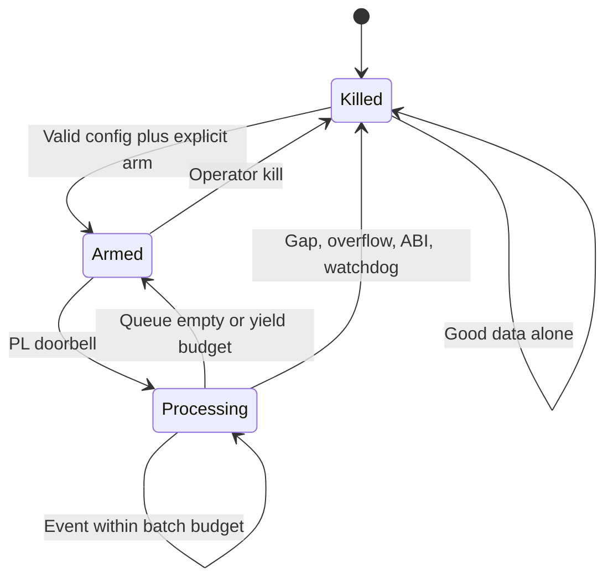
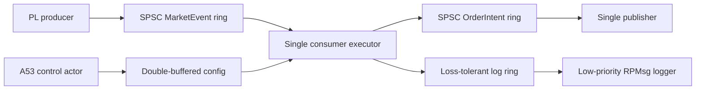

# Cortex-R5 firmware architecture

## Cooperative execution

One highest-priority trading task owns market sequence, risk, and order state.
Handlers run to completion and cannot block, allocate, or take a mutex. The
executor drains a bounded batch and reaches an explicit yield point. FreeRTOS
preemption remains available for interrupt wakeup and an exceptional watchdog,
not for peer trading tasks.

## Compile-time composition

- Boost.MP11 defines the ordered risk-rule list.
- CRTP rules remove virtual dispatch from checks.
- CIB provides compile-time log metadata/composition.
- `fmt` formats diagnostics into fixed storage.
- Generated descriptors provide protocol and register constants.
- A fixed-frame coroutine type supports low-priority, explicitly resumed
  control sequences. Coroutines are not used in the trading event chain.

## Queue ownership

Producer and consumer indices occupy distinct cache lines. CPU queues use
release/acquire publication. PL/shared-memory adapters additionally perform AMD
barriers and cache maintenance. Full market or intent queues fail closed;
telemetry/log queues may drop with counters.

## Risk rules

Rules execute in a fixed order: ABI, trading state, side, nonzero/max quantity,
price collar, symbol enable, monotonic source sequence, rate window, and open
order cap. An accepted intent receives the active risk revision. State changes
only after all rules accept.

## Ownership and memory

The runtime graph uses static/value ownership. `std::unique_ptr` appears for
move-only platform resources and the fixed pool returns smart pointers with a
custom deleter. `shared_ptr` is prohibited in the hot path. Exceptions and RTTI
are disabled in the target build. Host tests use ASan/UBSan and GoogleMock
interfaces; GoogleTest is not linked into target firmware.

## FreeRTOS and platform seam

`firmware_main.cpp` exposes weak hooks for the timestamp source, PL event poll,
RPMsg intent publication, and log publication. The AMD BSP build replaces these
hooks and defines `HFT_WITH_XILINX_FREERTOS`. CI also links a freestanding ELF
without the BSP to prove Cortex-R5 code generation. Actual TTC, GIC, OpenAMP,
stack watermark, and interrupt-priority behavior require future hardware tests.
