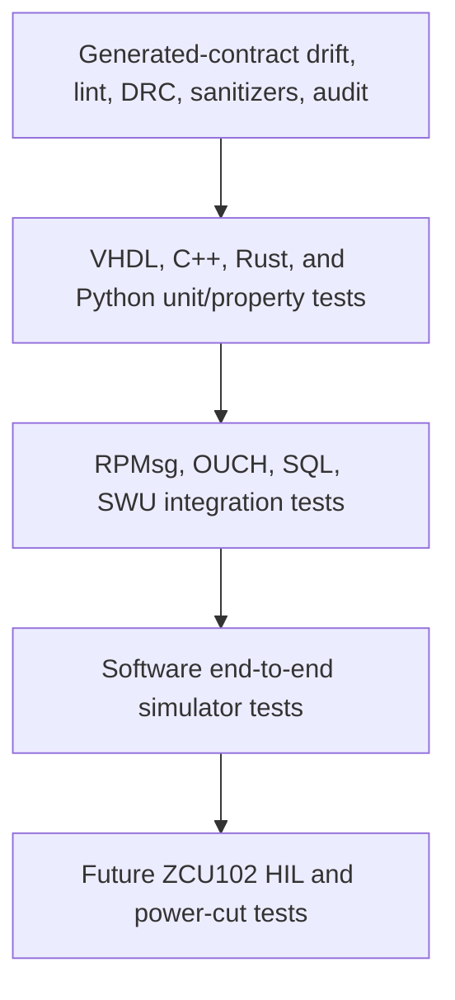

# Verification architecture

## Test pyramid

Hardware tests are specifications only until a board exists; CI stops at the
software end-to-end layer.

## Common vectors

One generated corpus is consumed by VHDL and Rust and is available to C++/Python
models. It covers valid Add/Cancel, heartbeat, truncation, and deterministic
session/sequence values. Expansion cases include all supported ITCH/OUCH types,
minimum/maximum integers, packet coalescing, unknown types, gaps, duplicate
references, queue saturation, and reset at every byte boundary.

## Per-layer checks

- **VHDL:** VUnit test cases, GHDL compatibility, NVC statement/branch coverage,
  OSVVM functional bins, VSG, Vivado methodology/timing/CDC locally.
- **C++:** GoogleTest/GoogleMock, typed boundary seams, ASan/UBSan, clang-tidy,
  gcovr, Cortex-R5 compile/link/map/size checks.
- **Rust:** mockall traits, Tokio paused time, proptest, cargo-fuzz target,
  Clippy, rustfmt, cargo-audit/deny, llvm-cov, AArch64 link.
- **Python:** pytest, Hypothesis-ready deterministic helpers, Ruff, mypy, and
  coverage for simulator/update/debug tools.
- **Yocto/SWUpdate:** layer parse, image manifest/SBOM, migration execution,
  hash/signature rejection, deterministic newc layout, inactive-slot image
  writes.

## Coverage policy

Generated and vendor code is excluded. Portable R5 handwritten code targets
90% line and branch coverage; target-only BSP hooks require future HIL evidence.
Rust excludes process entrypoints and direct device/PostgreSQL adapters from the
unit threshold but requires integration tests for those boundaries. VHDL
requires all named protocol/risk functional bins even when statement percentage
is already met. Reports are merged under `coverage-reports/index.html`.

## Future HIL scenarios

1. Program the locally generated bitstream without enabling live endpoints.
2. Boot each A/B slot and verify build/ABI IDs.
3. Exercise remoteproc stop/start and R5 watchdog recovery.
4. Replay line-rate and pathological traffic; measure p50/p99/p99.9.
5. Add telemetry, database, and update load while measuring scheduler jitter.
6. Interrupt SWUpdate writes and power during each boot stage.
7. Verify bootlimit rollback and persistent database compatibility.
