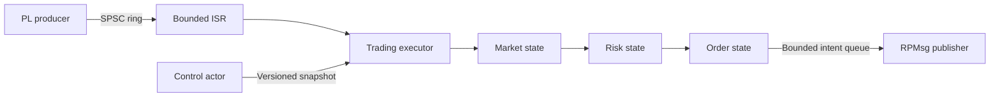

# Concurrency model

## PL to R5

The PL is the single producer and R5 is the single consumer of the market-event
ring. Descriptors and payloads are written before the producer index is
published. R5 applies the required device-memory barrier before consuming a new
index. Queue indices occupy separate cache lines. Full rings fail closed:
trading is killed and the event stream is marked stale.

## Cooperative R5 executor

One highest-priority task owns market, risk, and order state. A PL ISR only
acknowledges the source, publishes a descriptor, and sends a direct task
notification. The executor drains at most a configured batch, runs each handler
to completion, publishes resulting intents, applies a pending immutable control
snapshot, and reaches an explicit scheduling point.

No handler blocks, allocates, logs synchronously, or takes a mutex. A watchdog
is the only task allowed to preempt normal application work. Global FreeRTOS
cooperative mode is not assumed because it can increase interrupt-to-task wake
latency; this decision will be revisited only with hardware measurements.

## A53 actors

The OUCH connection, RPMsg endpoint, update state, and each database batch have
one owning Tokio task. Bounded channels transfer values. Immutable configuration
is shared through `Arc`; updates replace a versioned snapshot. Order/control
paths do not use `Arc<Mutex<_>>`. CPU-heavy analytics yields explicitly or runs
on a separate bounded blocking pool.

## Memory ordering

CPU-only SPSC queues use release publication and acquire consumption. Device and
noncoherent shared memory additionally use AMD architecture barriers and cache
maintenance inside the platform adapter. Tests model weak publication order;
actual cacheability and barrier behavior remain a hardware-verification item.
